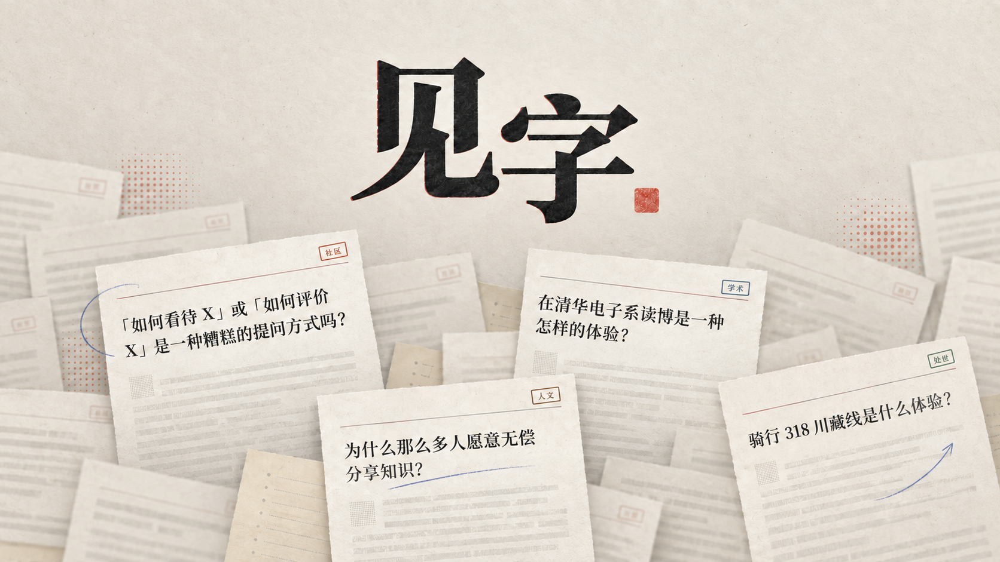
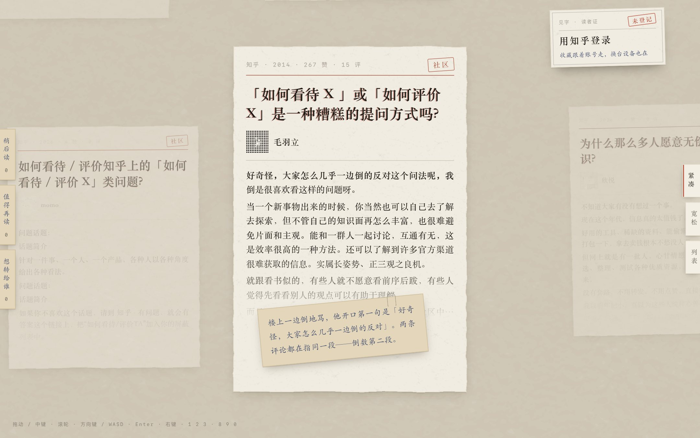
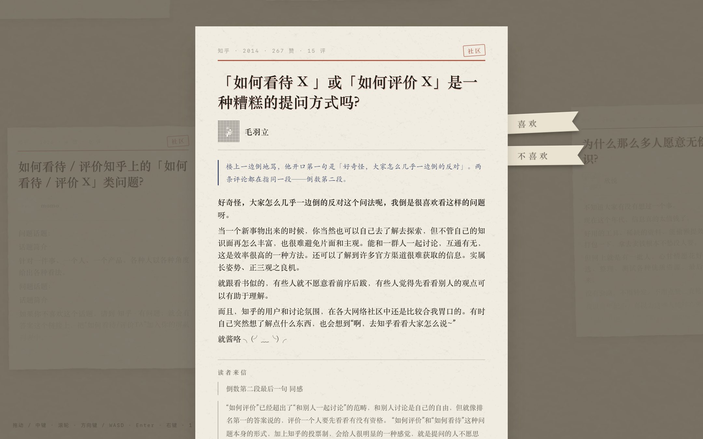
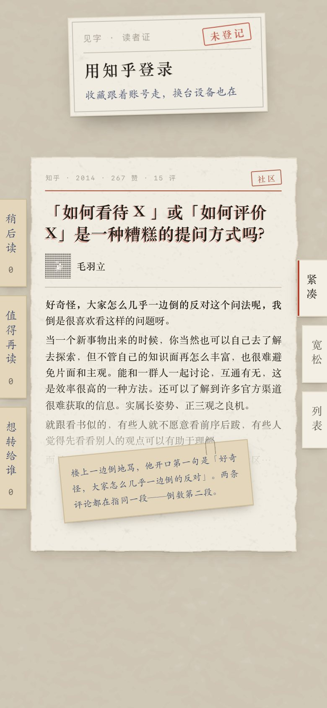

<p align="center">
  
</p>

<p align="center">
  <b>见字 JIANZI</b> · Meet the person behind the words.<br>
  在知乎，遇见认真写字的人。
</p>

<p align="center">
  <a href="https://jianzi-alpha.vercel.app"><b>打开线上体验：jianzi-alpha.vercel.app</b></a>
</p>

---

打开知乎的时候，很多人手里并没有要问的问题，只是想读点东西。见字把知乎上写得认真的回答剪成一张张剪报，摊在一张没有边的桌子上。拖着桌子走，会碰到一个自己从没搜过的问题，也会碰到写下回答的那个人。翻过来读开头，想读完，就去知乎看原文。

它不替你总结答案，也不把长回答压成知识卡片。读的那部分留在知乎。



<table>
  <tr>
    <td width="66%"></td>
    <td width="34%"></td>
  </tr>
</table>

## 怎么用

| 想做的事 | 鼠标和触控板 | 键盘 |
| --- | --- | --- |
| 挪桌子 | 拖动；触控板两指；滚轮，或按住中键拖 | 方向键、WASD，一次正好换一张 |
| 翻开一张 | 点一下 | Enter |
| 放回桌上 | 点四周 | Esc |
| 收藏 | 把左边的标签拖到卡上，或按住卡片拖到标签上 | 1 稍后读、2 值得再读、3 想转给谁 |
| 换个摆法 | 右边的标签：紧凑、宽松、列表 | 8、9、0 |
| 喜欢或不喜欢 | 右键卡片，或翻开后点纸边的丝带 | |

第一次打开时，桌子正中是一张说明卡，背面写全了上面这些。手机上拖动桌子、轻点翻开也都能用。

## 推荐反着来

你喜欢或不喜欢过的领域，往牌堆后面放；还没碰过的领域，往前摆。不喜欢的卡离开牌堆。喜欢的卡留着，只是每上桌一次就歇两轮，过一阵还会回来。

发牌规则在 `lib/deal.ts`，是纯函数。歇多久按发牌次数算，不靠随机数，所以同样的操作发出同样的牌，能测，也讲得清楚。喜欢和不喜欢只记在浏览器里，不上传。

## 内容从哪里来

内容只来自知乎开放平台接口和人工挑选，不爬取知乎站点。现在的内容池有 160 张卡，其中 108 张是 2014 到 2017 年写下的回答。

- 用问题标题当种子，不用话题关键词。关键词搜出来的几乎都是最近的内容，2026 年 9 月 6 日试过一次，50 条里有 47 条是当年的。换成问题标题，能翻到 2014 年的回答，也能翻到没几个赞的回答。
- 入池要过三道门槛：是知乎站内的页面，有作者名，头像不是匿名占位图。原始结果里大约六成没有作者，没有作者，就谈不上遇见一个人。
- 头像在建池时下载到 `public/avatars`。知乎图床可能拒绝别的站点引用，失败时不报错，上线后就是一片破图。
- 抓取和编辑分成两个文件。`content/pool.json` 由脚本生成；`content/curation.json` 由人写，存每张卡的领域和一句推荐理由。重跑抓取不会冲掉人写的理由。

## 缺东西的时候

| 情况 | 页面上 |
| --- | --- |
| 回答没有作者信息 | 署名写「署名不详」，头像换成网点 |
| 作者没有认证文案 | 只排名字，不留空行 |
| 没有精选评论 | 专栏里不出现「读者来信」 |
| 内容池是空的 | 桌上一张说明，写明这一版内容池是空的 |
| 知乎登录没成功 | 读者证上提示，可以再试一次 |
| 收藏没能同步到账号 | 提示先留在这台浏览器里，下次再同步 |
| 知乎头像加载失败 | 读者证上换成名字的第一个字 |

## 技术方案

- Next.js 16 App Router、React 19、TypeScript，部署在 Vercel。页面、接口和知乎 OAuth 回调在同一个域名下。
- 卡片桌不用页面滚动。一个 `requestAnimationFrame` 循环让镜头追着输入走，每帧只写 transform、opacity 和几个 CSS 变量；只有进出屏幕的格子变了，React 才重新渲染。手势交给 `@use-gesture/react`。
- 桌子是一张无限网格，布局在 `lib/desk.ts`。一次访问里每个格子一直放同一张卡，走开再回来，卡还在原处。服务端按笔记本屏幕先发好第一屏，页面一出来，正中就是一张卡。
- 纸的质感来自纸纹贴图和 SVG 毛边滤镜。每张卡的倾斜、纸纹位置和毛边形状都由卡片 id 算出来，刷新也不变。
- 知乎登录走 OAuth 授权码流程，写成 Route Handlers（`app/api/auth/*`）。会话是 HMAC 签名的 httpOnly Cookie，服务端不另存会话。
- 登录后，收藏按知乎账号存进 Upstash Redis，一个用户一条 JSON。没登录时收藏在浏览器里，登录后合并上去。

## 本地运行

需要 Node.js 20.9 或更高版本。

```bash
npm install
cp .env.example .env.local
npm run dev
```

打开 http://localhost:3000 。环境变量可以先不填：卡片桌、翻开、喜欢与不喜欢、浏览器里的收藏都能用，只是知乎登录和账号收藏用不了，点登录会回到首页并提示没有成功。

提交前的检查：

```bash
npm run lint
npx tsc --noEmit
npm run build
```

## 环境变量

都只在服务端读取，不要加 `NEXT_PUBLIC_` 前缀。

| 变量 | 用途 |
| --- | --- |
| `ZHIHU_OAUTH_APP_ID` | 知乎开放平台 OAuth 的 app id |
| `ZHIHU_OAUTH_APP_KEY` | 知乎开放平台 OAuth 的 app key |
| `ZHIHU_OAUTH_REDIRECT_URI` | 回调地址，要和开放平台登记的一字不差，形如 `https://你的域名/api/auth/callback` |
| `SESSION_SECRET` | 会话 Cookie 的签名密钥，至少 32 个字符 |
| `UPSTASH_REDIS_REST_URL`、`UPSTASH_REDIS_REST_TOKEN` | 账号收藏的存储 |
| `KV_REST_API_URL`、`KV_REST_API_TOKEN` | 同上。接入 Vercel 的存储集成时会自动写入，和上一组二选一 |

## 重建内容池

```bash
# 串行抓取种子问题的原始搜索结果，默认写到 ../pool-raw
ZHIHU_KEY_MAX=<开放平台 Access Secret> node scripts/fetch-seeds.mjs

# 过滤、下载头像，生成 content/pool.json
node scripts/build-pool.mjs
```

之后在 `content/curation.json` 里给新卡补上领域和推荐理由。

## 目录

```text
app/
  page.tsx          卡片桌
  components/       桌子、卡片、专栏、列表、收藏标签、读者证
  api/              知乎登录和收藏接口
  sheet/            内部策展页，把所有卡片正面平铺开
lib/                发牌、布局、偏好、收藏；lib/server 只在服务端运行
content/            内容池和人工策展
scripts/            建池脚本
public/             纸纹、引导插图、作者头像、品牌图
docs/               需求和交接文档
```

## 红线

- 不爬取知乎站点。
- Access Secret、`app_key`、OAuth token 只放在服务端环境变量里，不进仓库、前端响应、日志、截图和演示视频。
- 喜欢和不喜欢只记在浏览器里。

---

<p align="center">知乎黑客松 2026 · 校园新锐季参赛作品</p>
