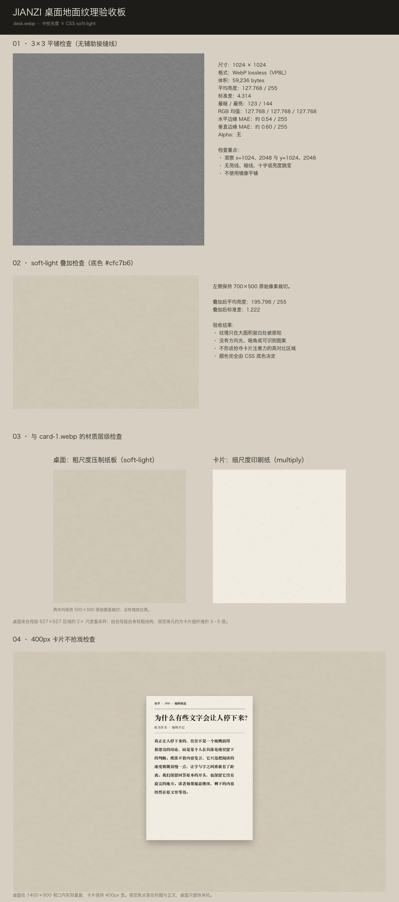

# JIANZI（见字）桌面地面交接

**日期**：2026-09-14

**状态**：桌面地面灰度纹理已交付并通过本轮验收

**采用方案**：中灰纹理层 + CSS `soft-light`

## 1. 本轮交付范围

本轮只交付桌面地面。这是当前项目最后一项需要生成的位图素材；卡片纸纹已经交付，纸条复用卡片灰度纹理，毛边与撕口已经改用 SVG 滤镜实现。

交付文件：

| 文件 | 用途 | 是否进入产品首屏 |
| --- | --- | --- |
| `public/paper/desk.webp` | 正式桌面灰度纹理，供 CSS `soft-light` 叠加 | 是 |
| `docs/assets/desk-texture-qa.webp` | 平铺、叠加、材质层级和不抢戏验收板 | 否 |
| `docs/desk-ground-handoff.md` | 本交接文档 | 否 |

验收板：



## 2. 正式素材说明

### `public/paper/desk.webp`

- 尺寸：1024×1024
- 格式：WebP lossless（VP8L）
- 文件体积：59,236 bytes
- 色彩：严格中性灰度；解码后 R、G、B 平均值均为 127.768
- 平均亮度：127.768 / 255
- 标准差：4.314
- 最暗 / 最亮：123 / 144
- 水平相对边缘 MAE：约 0.54 / 255
- 垂直相对边缘 MAE：约 0.60 / 255
- Alpha：无

正式文件是以 128 为支点的低对比灰度调制层，不是完成态桌面照片。它单独看应当平、灰、安静；实际材质颜色由 CSS 的 `--desk` 决定。

建议用法：

```css
.desk {
  background-color: var(--desk);
  background-image: url("/paper/desk.webp");
  background-blend-mode: soft-light;
  background-repeat: repeat;
}
```

不要给纹理设置 `cover`，也不要把它拉伸到视口尺寸。1024×1024 原生重复是这张素材的预期用法。

## 3. 我做了什么

1. 阅读冻结的视觉规范、前序卡片纹理交接和桌面原始需求，确认只生成桌面，不恢复已取消的纸条或边缘素材。
2. 选择“压制纤维纸板”作为材质方向，没有选择亚麻布。亚麻容易残留规则经纬，压制纸板更容易保持无方向、严肃和低对比。
3. 使用现有 `card-1.webp` 作为尺度参考，通过内置 `imagegen` 生成第一张桌面工作母版。
4. 第一张候选含有较多孤立深色纸屑，可能在全视口上成为识别地标，因此没有交付。
5. 以第一张为编辑目标，只调整材质结构：去除孤立碎屑和长暗纤维，改为更宽、更软的压制纸浆变化，同时保持正视、均匀光照和中性要求不变。
6. 从第二张 1254×1254 母版中选取 627×627 的无显著焦点区域，再放大为 1254×1254。该 2× 尺度重采样叠加母版本身较粗的结构，使最终桌面视觉单元约为卡片细纤维的 3–5 倍。
7. 利用 1254 与目标 1024 之间多出的 230px 做相对边缘平滑重叠，将母版周期化裁成 1024×1024；没有使用镜像平铺。
8. 转为严格灰度并将分布归一到中灰：工作结果平均亮度约 128.05、标准差约 5.87，极端值被限制在不会形成暗斑的范围内。
9. 使用跨边界的 `virtual-pixel tile` 模糊去除高频噪声，再做轻微对比恢复和少量灰阶量化，使最终标准差保持在 4–9，同时将无损 WebP 控制到 60KB 内。
10. 对最终解码文件执行 3×3 平铺、通道中性、`#cfc7b6` soft-light 叠加、与 `card-1.webp` 的材质层级、1400×900 桌面上的 400px 卡片焦点和纯净度检查。

## 4. 生成提示词

生成使用内置 `imagegen`，没有使用需要 API Key 的 CLI fallback。

### 初始生成

```text
Use case: stylized-concept
Asset type: seamless neutral grayscale desk-ground modulation texture for a production web UI using CSS background-blend-mode: soft-light
Input images: Image 1 is a scale reference only for the existing fine card-paper texture. Do not edit or reproduce it. Generate a new desk-ground material whose structural units are approximately 3 to 5 times coarser than Image 1.
Primary request: Create one square material texture containing only the restrained surface structure of clean matte pressed fiberboard or heavy uncoated archival board. This is a working master for later grayscale normalization, not a finished colored desk photograph. The texture should quietly establish a surface beneath paper cards without becoming a visual subject.
Scene/backdrop: the material fills the entire canvas edge to edge; no surrounding scene, sheet outline, border, tabletop objects, or card.
Style/medium: photorealistic flatbed-scan-like material capture; matte compressed paper fibers; broad soft organic fiber clusters mixed with sparse coarse pulp flecks; understated, serious, contemporary; no regular weave.
Composition/framing: orthographic front view, square 1:1, no perspective, no focal point, no isolated landmark. Designed to repeat seamlessly on all four edges, with matching edge brightness and texture continuity.
Lighting/mood: completely uniform diffuse illumination; flat albedo-like appearance; no directional light, shadow, highlight, gloss, embossing, depth, vignette, or large brightness gradient.
Color palette: strictly neutral grayscale only. Preserve useful source contrast in the working master; final mean luminance and standard deviation will be normalized deterministically.
Texture behavior: non-directional, low visual contrast, smooth distribution around a neutral midpoint, structural units clearly 3–5 times larger than the fine fibers in Image 1; enough irregular variation to read as a different material scale, but no recognizable motif, repeating blob, stain, or cloudy focal patch.
Constraints: seamless and tileable on all four edges; no text, symbols, watermark, wood grain, obvious woven grid, linen crosshatch, diagonal direction, stains, dirt, aging, coffee marks, folds, creases, wrinkles, seams, holes, paper edges, photographic background, or objects.
Avoid: office desk photography, rustic wood, burlap, canvas weave, checker patterns, antique cardboard, scrapbook styling, grunge, dramatic grain, large dark splotches, light falloff, soft-focus smears.
```

### 单变量编辑

```text
Use case: precise-object-edit
Input images: Image 1 is the current desk-ground fiberboard working master and edit target.
Primary request: Change only the material structure. Remove the isolated dark paper chips, leaf-like fragments, long dark strands, and recognizable individual flecks. Replace them with broader, softer, low-contrast compressed fiberboard variation: diffuse organic pulp clusters and short coarse fibers whose structural units are visibly larger and calmer, without any single mark becoming a landmark.
Invariants: preserve the square edge-to-edge orthographic material texture, neutral grayscale palette, completely flat uniform diffuse albedo-like lighting, no perspective or material outline, non-directional character, matte pressed-fiberboard identity, and intended seamless tileability on all four edges.
Constraints: no text, symbols, watermark, wood grain, woven grid, crosshatch, stains, dirt, aging, folds, creases, seams, holes, objects, vignette, shadows, highlights, gloss, depth, large dark splotches, or new elements.
```

## 5. 验收结果

| 检查项 | 结果 | 说明 |
| --- | --- | --- |
| 平铺检查 | 通过 | 3×3 实际平铺未见亮线、暗线、十字或亮度跳变 |
| 中性检查 | 通过 | 最终 VP8L 解码后 R=G=B=127.768；不是仅在编码前中性 |
| 叠加检查 | 通过 | 以 `soft-light` 叠加 `#cfc7b6` 后，输出标准差约 1.222，只在留白处被感知 |
| 层级检查 | 通过 | 桌面为宽软压制纸浆结构，卡片为细短印刷纸纤维，原始像素并排时可直接区分 |
| 不抢戏检查 | 通过 | 1400×900 桌面放置 400px 卡片后，视觉焦点落在卡片标题与正文 |
| 纯净检查 | 通过 | 无文字状笔画、木纹、经纬格、方向光、污渍和孤立重复团块 |
| 统计检查 | 通过 | 平均亮度 127.768，位于 128±6；标准差 4.314，位于 4–9 |
| 体积检查 | 通过 | 59,236 bytes，小于 60,000 bytes，也小于 60KiB |
| 格式检查 | 通过 | 1024×1024、WebP lossless、无 Alpha、无动画 |

## 6. 取舍解释

### 选择压制纤维纸板，而不是亚麻布

亚麻的材质身份依赖经纬结构；即使提示词要求“不要明显格纹”，模型仍容易生成方向性和周期性交叉线。压制纤维纸板可以依靠不规则纸浆团块建立物质感，与资料馆索引卡语境相容，也更容易保持安静。

### 不直接复用 `card-1.webp`

卡片纹理是 1024² 上的细短纤维。桌面若只换底色，会让卡片与桌面看起来来自同一张纸，失去承托层级。新的桌面素材通过更宽、更软的结构单元明确区分两种材质。

### 使用 2× 尺度重采样

模型已经生成了比卡片更粗的纸浆结构，但仍保留不少细节。选取母版 627×627 区域放大到 1254×1254，可以在不增加新图案的情况下把结构再放大一档。没有简单模糊到失去材质，也没有拉伸最终 1024 纹理。

### 不使用镜像平铺

镜像虽然能快速消除硬边，但会形成蝴蝶状对称和更短的视觉周期，在 2560px 宽屏上容易被发现。当前方案使用母版多出的 230px 做相对边缘重叠，再以跨边界模糊维持周期连续。

### 只保留少量灰阶

桌面通过 `soft-light` 使用，最终视觉波动非常小。保留大量相近灰阶不会带来可见质量收益，却会显著增加无损 WebP 的熵和文件体积。少量灰阶经过低通处理后表现为柔软纸浆变化，不出现抖动颗粒或硬色阶边界。

### 使用无损 WebP，而不是更小的有损 WebP

需求明确要求最终解码后 R=G=B。普通有损 WebP 使用 YUV 编解码，前序卡片素材已验证可能产生微小通道差。VP8L 让最终文件保持严格中性，59,236 bytes 仍满足体积要求。

### 没有修改 `--desk` 或前端 CSS

本轮授权范围是生成素材和验收文档。当前 `--desk: #cfc7b6` 仍是占位色，后续可能调深；中灰纹理以 128 为支点，可以继续服务新的底色。直接修改页面会把素材交付扩大为视觉实现任务，因此本轮不做。

### 验收板使用明确的 soft-light 公式

QA 合成按 W3C/CSS soft-light 的逐通道公式计算，而不是依赖某个图像软件对灰度输入的特殊处理。这样验收板反映的是浏览器混合语义。产品运行时仍直接使用标准 CSS `background-blend-mode: soft-light`。

## 7. 授权与来源

- 工作母版由内置 `imagegen` 工具生成。
- 输入参考只有项目自身已交付的 `public/paper/card-1.webp`，仅用于比较纤维尺度。
- 没有使用第三方照片、素材站图片、商标、IP 或人像。
- 正式素材是生成结果经过本地确定性周期化、灰度归一、低通、量化和无损编码后的派生文件。
- 未提交生成工作母版和中间 PNG；复现所需完整提示词与处理决策已记录在本文件。

## 8. 原始需求

以下内容来自本轮开始前已经提交的 `docs/desk-ground-request.md`，原文完整收录。

````markdown
# 素材需求 · JIANZI（见字）桌面地面

**日期**：2026-09-14
**状态**：待生成
**前序**：`docs/paper-texture-handoff.md`（卡片纸纹，已交付并验收通过）

---

## 0. 给接手 Agent 的话

这是本项目**最后一项**需要生成的素材。原始需求文档里列过四类（卡片纸纹 / 纸条纸 / 边缘蒙版 / 桌面地面），现在只剩桌面这一类还需要你。

**另外三类已经不需要素材了，不要做：**

| 原需求 | 现状 |
|---|---|
| 卡片纸纹 | ✅ 已交付 `public/paper/card-1.webp`，验收通过 |
| 纸条纸 | ❌ **不需要**。B 方案的灰度纹理本来就设计成一张同时服务卡片、纸条、桌面，纸条只换 CSS 底色 |
| 边缘蒙版（毛边 / 撕口） | ❌ **不需要**。卡片高度已改为跟随内容，栅格蒙版必须拉伸而拉伸会改变纤维尺度。已改用 `feTurbulence` + `feDisplacementMap` 滤镜实现，与尺寸和分辨率都无关 |

---

## 1. 这是什么

一个网页产品，把精选的知乎回答做成纸质卡片摊在一张桌面上。视觉定位是**纸张拟物 + 报纸质感**，参照物是「编辑的书桌」和「资料馆的索引卡」。

你要做的是**卡片底下那张桌面**。

它是背景。它唯一的工作是让纸看起来是躺在什么东西上面，而不是浮在纯色里。它**不能抢戏**。

---

## 2. 沿用 B 方案

和卡片纸纹一样：**你只生成灰度纹理，颜色由 CSS 给。**

但桌面和卡片有一个关键区别——**卡片是浅色，桌面是深色**。

卡片那张纹理平均亮度 251.66（接近全白），用 `multiply` 叠在浅暖白上。同一个做法搬到深色底上，纹理会被压得完全看不见。

所以桌面这张要按 **`soft-light` 或 `overlay`** 来设计，这两个混合模式以中灰为支点：

- **平均亮度要落在 128 附近**（不是接近白，也不是接近黑）
- **标准差要小**，大致 4 到 9。太大桌面会花，会把视线从卡片上拽走
- 比中灰亮的像素让底色提亮，比中灰暗的让底色压暗，所以中灰附近的分布要平滑对称

这是这个方案唯一容易翻车的地方，请重点盯。

---

## 3. 材质性格

**深色纸板、亚麻布面、或未涂布卡纸。** 低对比，无光泽。

**尺度必须明显粗于卡片的纸纤维。** 这是这张素材存在的理由——如果桌面和卡片共享同一个纤维尺度，材质层级就消失了，看起来会像卡片和桌面是同一张纸。粗一档，让人一眼分得出「这是桌布/卡纸，那是印刷纸」。

具体粗多少：卡片纹理是 1024² 上的细短纤维；桌面的结构单元大致要比它大 **3 到 5 倍**。

### 明确不要的

- **木纹**。会变成办公室摆拍，而且很俗
- **明显的编织格纹**。规律的经纬会和卡片上的报纸版式打架
- **方向光、投影、立体感、暗角**。光影全部由前端加
- **污渍、做旧斑点、咖啡渍、折痕**。这是手账风，会把严肃内容轻佻化
- **任何可识别的重复团块**

---

## 4. 技术要求

| 项 | 要求 |
|---|---|
| 尺寸 | 1024 × 1024 |
| 平铺 | **必须无缝**。桌面是全视口，宽屏 2560px 起步 |
| 格式 | WebP |
| 体积 | **≤ 60KB** |
| 色彩 | 严格中性灰度，解码后 R=G=B。任何偏色都会在深色底上被放大 |
| 平均亮度 | 128 ± 6 |
| 标准差 | 4 – 9 |
| Alpha | 无 |
| 路径 | `public/paper/desk.webp` |

前端用法大致是：

```css
.desk {
  background-color: var(--desk);
  background-image: url('/paper/desk.webp');
  background-blend-mode: soft-light;
  background-repeat: repeat;
}
```

---

## 5. 验收标准（每一条都要实际做一次）

1. **平铺检查**：3×3 实际平铺，接缝处无亮线、暗线、十字或亮度跳变。**AI 说自己生成的是无缝的，十次有八次不是，必须真的拼一次看。**
2. **中性检查**：最终 WebP **解码后** R=G=B，不是仅在编码前中性。卡片那张就是因为有损 WebP 的 YUV 编解码产生了 0.23 级通道偏差，最后改用了无损。
3. **叠加检查**：以 `soft-light` 叠在 `--desk`（当前占位值 `#cfc7b6`，可能会调深）上，纹理应当**只在留白处被感知**，不应形成任何吸引视线的图案。
4. **层级检查**：把交付的桌面纹理和 `public/paper/card-1.webp` 按各自的叠加方式并排渲染，要能一眼看出两者是不同尺度的材质。这一条不过，这张素材就没有存在意义。
5. **不抢戏检查**：桌面上放一张 400px 宽的浅色卡片，视线应当落在卡片上。如果眼睛先被桌面纹理吸引，降低对比度重做。
6. **纯净检查**：放大看没有文字状笔画、重复团块、糊斑。
7. **体积检查**：≤ 60KB。

---

## 6. 授权（硬约束）

赛事规则原文：「不得未经授权使用第三方商标、IP、人像、版权素材」，违规后果是取消参赛资格。

- AI 生成的素材没问题
- 自己实拍的没问题
- 从素材站下载的**要看清授权页并留存证明**

交付时在文档里写明来源。

---

## 7. 交付物

1. `public/paper/desk.webp` — 正式素材
2. `docs/assets/desk-texture-qa.webp` — 验收板（平铺、叠加、与卡片纹理的层级对比、放卡片的不抢戏检查）
3. `docs/desk-ground-handoff.md` — 交接文档，格式参照 `docs/paper-texture-handoff.md`：收录原始需求、你做了什么、文件解释、取舍解释、验收结果、授权与来源、完整的生成提示词

工作母版（未压缩的大图）不要提交，仓库是公开的，只留能复现的提示词。
````
