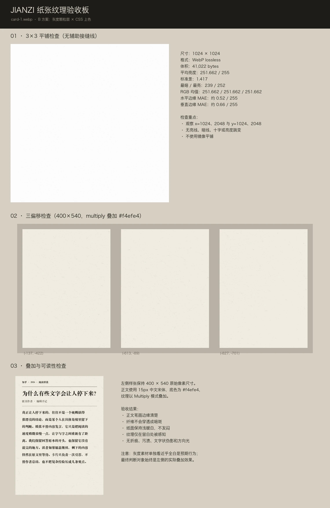

# JIANZI（见字）纸张纹理交接

**日期**：2026-09-14

**状态**：卡片灰度纹理第一版已交付并通过本轮验收

**采用方案**：B——灰度颗粒层 + CSS 上色

## 1. 本轮交付范围

本轮只交付优先级最高的卡片纸纹，不包含纸条、边缘蒙版和桌面地面。这样可以先验证 B 方案最关键的技术链路：灰度纹理能否同时通过无缝平铺、固定偏移、正文可读性、严格中性和 50KB 体积限制。

交付文件：

| 文件 | 用途 | 是否进入产品首屏 |
| --- | --- | --- |
| `public/paper/card-1.webp` | 正式卡片灰度纹理，供 CSS `multiply` 叠加 | 是 |
| `docs/assets/paper-texture-qa.webp` | 3×3 平铺、三偏移和正文叠加验收板 | 否 |
| `docs/paper-texture-handoff.md` | 本交接文档 | 否 |

验收板：



## 2. 正式素材说明

### `public/paper/card-1.webp`

- 尺寸：1024×1024
- 格式：WebP lossless
- 文件体积：41,022 bytes
- 色彩：严格中性灰度；解码后 R、G、B 平均值均为 251.662
- 平均亮度：251.662 / 255
- 标准差：1.417
- 最暗 / 最亮：239 / 252
- 水平相对边缘 MAE：约 0.52 / 255
- 垂直相对边缘 MAE：约 0.66 / 255
- Alpha：无

素材单独看接近白色是预期行为。它不是完成态纸张照片，只负责给纯色底增加极淡的纤维与颗粒。

建议用法：

```css
.card {
  background-color: var(--paper);
  background-image: url("/paper/card-1.webp");
  background-blend-mode: multiply;
  background-repeat: repeat;
  background-position: var(--paper-x) var(--paper-y);
}
```

卡片 ID 应映射为稳定的负偏移值；同一卡片每次出现使用同一组偏移，不同卡片使用不同偏移。不要把纹理拉伸到卡片尺寸。

## 3. 我做了什么

1. 阅读项目视觉规范，确认纸张拟物只承担材质，不引入折痕、污渍、摆拍光影或手账装饰。
2. 采用内置 `imagegen` 路线生成第一张纤维母版，没有使用需要 API Key 的 CLI fallback。
3. 第一张候选纤维过密、过长，容易读成手工棉纸，因此没有交付。
4. 以第一张为编辑目标，只调整纤维性格：缩短、变细、降低密度，保持中性、正视和均匀光照不变。
5. 选定第二张 1254×1254 母版。利用多出的 230px 做相对边缘平滑重叠，将其周期化裁成 1024×1024；没有采用镜像平铺。
6. 转为灰度，把工作母版的动态范围压缩到接近白色，并限制极端暗纤维。
7. 比较普通有损 WebP 与无损灰阶 WebP。普通有损版本体积约 35KB，但解码后产生约 0.23 级的通道偏差；最终改为轻微 0.30px 去噪、少量灰阶量化和 WebP lossless，得到完全中性的 41,022-byte 文件。
8. 对最终解码文件执行 3×3 平铺、相对边缘差异、三组固定偏移、`#f4efe4` multiply 叠加和 15px 中文正文检查。

## 4. 生成提示词

### 初始生成

```text
Use case: stylized-concept
Asset type: seamless neutral grayscale paper-fiber modulation texture for a production web UI using CSS background-blend-mode: multiply
Primary request: Create one square material texture containing only the subtle physical fiber structure of clean uncoated cotton-pulp reading paper. This is a working master, not a finished colored paper photograph. Preserve restrained but clearly recoverable fine fiber detail so it survives later grayscale normalization and WebP compression.
Scene/backdrop: The paper microtexture fills the entire canvas edge to edge; no surrounding scene, no paper sheet outline, no border.
Style/medium: photorealistic flatbed-scan-like material capture; clean contemporary archival reading paper; fine irregular short fibers with a very small number of slightly longer fibers; sparse microscopic grain; serious and understated.
Composition/framing: orthographic front view, square 1:1, no perspective, no focal point, no isolated landmark. Designed to repeat seamlessly on all four edges, with matching edge brightness and texture continuity.
Lighting/mood: completely uniform diffuse illumination; flat albedo-like appearance; no directional light, shadow, highlight, embossing, depth, vignette, or large brightness gradient.
Color palette: strictly neutral grayscale, white to light gray only; no warm, cool, yellow, brown, blue, green, or magenta cast.
Texture behavior: subtle local variation at several small scales; enough spatial variation that three 400x540 crops from different offsets look different but clearly belong to the same paper; no broad cloudy areas or recognizable repeated clusters.
Constraints: seamless and tileable on all four edges; no text, symbols, watermark, stains, foxing, folds, creases, wrinkles, holes, torn edges, deckled edges, grids, ruled lines, fabric weave, wood grain, plastic sheen, dirt, photographic background, or paper silhouette.
Avoid: finished colored paper photograph, antique or yellowed paper, kraft paper, dirty newsprint, scrapbook styling, grunge, heavy grain, mid-gray background, dramatic texture, directional fibers, repeated blobs, soft-focus smears.
```

### 单变量编辑

```text
Use case: precise-object-edit
Input images: Image 1 is the current paper-fiber working master and edit target.
Primary request: Change only the fiber character: make the fibers substantially shorter, finer, sparser, and less individually recognizable, so the surface reads as clean contemporary uncoated book or writing paper rather than handmade cotton paper. Reduce conspicuous long dark strands and curled fibers while retaining subtle multi-scale natural paper variation that can survive later low-contrast normalization.
Invariants: preserve the square edge-to-edge orthographic material texture, strictly neutral grayscale palette, uniform flat diffuse albedo-like lighting, lack of perspective or paper outline, and intended seamless tileability on all four edges. Keep enough spatial variation for different offset crops to differ subtly.
Constraints: no text, symbols, watermark, stains, foxing, folds, creases, wrinkles, holes, edges, grids, ruled lines, fabric weave, wood grain, plastic sheen, dirt, vignette, shadows, highlights, or large brightness gradients. No new elements.
```

## 5. 验收结果

| 检查项 | 结果 | 说明 |
| --- | --- | --- |
| 平铺检查 | 通过 | 3×3 实际平铺未见亮线、暗线、十字或亮度跳变 |
| 可读性检查 | 通过 | `#f4efe4` 上叠加后，15px 中文正文清晰，纹理不穿透成干扰笔画的暗斑 |
| 同源检查 | 通过 | 当前只交付一张母纹理；全部卡片天然同源 |
| 体积检查 | 通过 | 41,022 bytes，小于 50KB，也小于 50KiB |
| 纯净检查 | 通过 | 无文字状笔画、污渍、折痕、方向光和明显重复团块 |
| 偏移检查 | 通过 | 三个 400×540 裁切能辨认出不同纤维位置，材质性格一致 |
| 叠加检查 | 通过 | 纸面保持浅暖白，没有发闷或产生可见偏色 |
| 中性检查 | 通过 | 最终 WebP 解码后 R=G=B；不是仅在编码前中性 |

## 6. 取舍解释

### 选择 B，而不是带颜色的纸张照片

颜色、亮度和纹理被拆成独立变量。Imagen 只负责生成自然纤维，CSS 负责纸色，后处理负责中性与亮度，因此比要求模型同时稳定控制白平衡和材质更可靠。

### 只交付一张正式卡片纹理

1024×1024 已明显大于 400×540 卡片，配合稳定背景偏移，三个测试裁切具有可辨差异。此时增加第二张纹理会增加维护和首屏体积，却还没有证据表明一张不够。等真实卡片桌出现可识别重复，再增加第二种纤维性格。

### 使用 1024×1024，而不是把母版放大到 1536×1536

内置生成得到的原始母版为 1254×1254。最终 1024×1024 可以利用 230px 的真实多余内容完成边缘重叠；强行插值到 1536 不会创造新的纤维信息，只会拉伸纹理并增加编码压力。

### 不使用镜像平铺

镜像可以快速消除硬边，但会产生对称结构和更短的视觉周期，在 1500px 以上的长专栏里容易暴露。当前方法使用母版真实的相邻区域跨边界闭合。

### 使用无损 WebP，而不是更小的普通有损 WebP

普通有损版本约 35KB，但 WebP 的 YUV 编解码使部分近白像素出现极轻微通道差。最终无损版本为 41,022 bytes，仍低于体积上限，并保证解码后的灰阶严格中性。

### 暂不复用到桌面

技术上可以给桌面使用同一张灰度纹理，但纸张与桌面共享完全相同的纤维尺度，可能削弱材质层级。桌面仍应等卡片实装后决定是否使用独立的更粗尺度纹理。

## 7. 授权与来源

- 纤维母版由内置 `imagegen` 工具生成。
- 没有使用第三方照片、商标、IP、人像或素材站资源。
- 正式素材是生成结果经过本地确定性处理后的派生文件。
- 未提交约 2.7MB 的生成工作母版，避免给公开仓库增加无运行价值的体积；复现所需提示词已完整记录在本文件。

## 8. 原始 User 输入

以下内容按本次对话中的 User 消息原样收录。

### User 输入 1

````markdown
这是一个图片生成请求，请你以 “Imagen” 的skill，先跟我讨论一下你打算怎么让它生成？

---

# 素材需求 · JIANZI（见字）纸张拟物

## 一、这是什么项目

一个网页产品，把精选的知乎回答做成一张「卡片桌」：几张纸质卡片摊在桌面上，中间那张清晰、周围渐次淡出，读者拖动挑选，点开后卡片翻面放大成一栏报纸专栏，读完跳转知乎原文。

视觉定位是**纸张拟物 + 报纸质感**。参照物是「编辑的书桌」和「资料馆的索引卡」。

产品的论点是反对 AI 把内容加工成光鲜的摘要卡片，所以界面必须有手工感和物质感。但内容本身常常很有分量（比如「麻醉科医生第一次独立上台」），所以质感要克制、严肃，不能可爱。

## 二、最重要的一条原则

**不要一张卡配一张素材。**

我们需要的是很少的几张高质量素材，全部卡片共用，卡片之间的差异由 CSS 生成（每张 ±1–2 度旋转、阴影深浅、极轻微色温偏移）。

原因：AI 生成的纸纹每张打光、白平衡、颗粒都不同，五张摆在同一张桌上会变成五张来源不同的库存图拼在一起——那正是要避开的拼贴感。真实感来自同源。

所以打磨的重点是**把两三张做到极好**，而不是产出很多张。

## 三、四类素材

### 1. 卡片纸纹（优先级最高，要 2–3 张）

用途：每张卡片的底纹，上面要压问题标题、作者署名、约 1000 字的正文。

| 要求   | 标准                                                       |
| ---- | -------------------------------------------------------- |
| 质感   | 微黄新闻纸或米白书写纸                                              |
| 光照   | 正面均匀打光，**没有阴影、没有折痕、没有透视**                                |
| 平铺   | **必须无缝平铺**（seamless / tileable）。卡片尺寸不固定，非平铺素材一拉伸纤维就变形    |
| 纹理强度 | **要弱**。宁可看起来「太淡」，CSS 里再叠对比度。纹理重了会影响正文可读性，而读完正文是这个产品的核心动作 |
| 尺寸   | 512×512 到 1024×1024。不要 4K                                |
| 数量   | 2–3 张，彼此有轻微区分（例如一张偏冷、一张偏黄），目的是让整副牌不完全均质                  |

参考色域：卡片纸大致在 `#f4efe4` 附近，浅暖白。

### 2. 纸条纸（1–2 张）

用途：一张小便签，斜压在卡片左下角，上面是手写的一句推荐理由。这是产品自己的嗓音，全屏唯一的手写。

- 比卡片**更深、更暖**，或者偏牛皮纸色，要和卡片拉开层次
- 尺寸小，**不需要平铺**
- 纹理可以比卡片明显一些，因为上面字少

### 3. 边缘蒙版（2–3 个，最容易被忽略但最关键）

纸的物理感集中在**边缘**和**接触阴影**。规整矩形配再好的纸纹照片还是像贴图；一条略不规则的毛边加一层贴着桌面的软阴影就立住了。

需要的是 **alpha 蒙版**（透明 PNG，或者直接 SVG 路径），不是带背景的图片。

两种边缘语义不同，素材也要不同：

- **毛边 / 齿边** —— 用在卡片正面四周，表示「这是被剪下来的一张剪报」。起伏细微，像纸张裁切后的纤维
- **撕口** —— 单独一个，用在卡片背面专栏的底部，表示「文字到这儿就没有了」。纤维更长、更乱、起伏更大，一眼看出是撕的而不是剪的

（背景：接口只返回回答开头约 1000 字，拿不到全文。撕口是把这个数据限制做成设计，下面接一行「余下的在知乎 →」。）

### 4. 桌面地面（1 张，可以最后做）

- 很暗、很平、低对比。深色纸板或亚麻布感
- 它是背景，不能抢戏
- 目前具体材质还没定，可以先放着

## 四、明确不要的东西

- **折痕、咖啡渍、烧焦边、做旧斑点** —— 这是手账/复古风，会把严肃内容轻佻化
- **胶带、图钉、回形针的实拍图** —— 这些用 CSS 画暗示就够，实拍会引入第二种光照方向
- **带透视、带投影、桌面摆拍的纸张照片** —— 我们要的是平面材质，光影由前端加
- **4K 大图** —— 每 KB 都要进首屏
- **格纹纸、横线本、方格本** —— 上面要排报纸版式，底纹有线会打架

## 五、交付格式

- 纹理优先 **WebP**，其次 JPG；单张**控制在 80KB 以内**
- 蒙版用 **PNG**（需要透明通道）或 **SVG**
- 建议命名（放 `public/paper/`）：
```
card-1.webp     card-2.webp     card-3.webp      卡片纸纹
slip-1.webp     slip-2.webp                      纸条纸
edge-deckle.svg（或 .png）                        毛边
edge-torn.svg（或 .png）                          撕口
desk.webp                                        桌面
```

## 六、验收标准（每一张都要过）

1. **平铺检查**：把纹理平铺成四宫格，接缝处看不出任何线条或亮度跳变。AI 说自己生成的是无缝的，十次有八次不是，**必须实际拼一次看**。
2. **可读性检查**：在纹理上压一段 15px 的中文正文，正常阅读距离下纹理不干扰认字。
3. **同源检查**：把 2–3 张卡片纸纹并排放，看起来要像从同一个本子上撕下来的，不能像三个不同来源。
4. **体积检查**：单张不超过 80KB。
5. **纯净检查**：放大看没有 AI 生成常见的伪影——重复的团块、莫名的文字状笔画、边缘的糊斑。

## 七、打磨时的常用抓手

如果生成结果不对，通常是这几个方向：

- 纹理太重 → 降低对比度、减少纤维密度
- 有阴影或立体感 → 强调平铺光照、去掉任何角度和景深
- 接缝明显 → 换用支持 tileable 的生成方式，或者生成后手工做边缘镜像/偏移修补
- 颜色太黄太做旧 → 往浅暖白拉，不要往牛皮纸方向跑（牛皮纸留给纸条）
- 看起来像塑料或布 → 强调纤维、棉浆、未涂布纸

## 八、授权

赛事规则写着「不得未经授权使用第三方商标、IP、人像、版权素材」。

AI 生成的没问题，自己实拍的纸没问题，从素材站下载的**要看清授权页并留存证明**。这一条是硬约束，违规后果是取消参赛资格。
````

### User 输入 2

````markdown
无缝可能做不到。但是仍然保持需求。

---

# 补充说明 · 素材需求第二版

接上一份需求文档。有两处要补充：一个是解释**为什么必须无缝**（这直接影响你判断素材合不合格），一个是**可能改变做法的技术方案**，需要你给个意见。

## 一、为什么坚持无缝平铺

单看一张卡片正面，其实用不着无缝——1024 的图 `cover` 铺满 400×540 的卡，根本不会重复。真正的原因有三个：

**1. 专栏背面很长。** 卡片翻面后会长成一栏长文，约 1000 字排下来高度轻松过 1500px，还可能内部滚动。不平铺就得把图拉长，纸纤维一抻就变形，一眼看出是假的。

**2. 桌面地面是全视口。** 宽屏下 2560px 起步，不平铺得准备一张巨图。

**3. 最主要的原因：每张卡要显示同一张纸的不同位置。**

整副牌（可能几十张）只用两三张素材，如果每张卡都 `cover` 同一张图，纤维走向、疤点位置完全一致，摊开一看就是同一张贴图复制了几十遍。

前端的做法是给每张卡一个由卡片 ID 算出的固定背景偏移：
```css
background-position: -137px -422px;  /* 每张卡不同，同一张卡每次一致 */
background-repeat: repeat;
```

这样几十张卡是从同一张纸上裁下来的几十个不同位置——**同源但不雷同**。而偏移一旦越过图片边界，不平铺的素材就会露出硬边或空白。

**所以无缝是这个手法成立的前提，没有商量余地。**

### 由此产生的尺寸修正

上一份写的「512×512 到 1024×1024 就够」需要修正。

如果纹理只有 512 见方，而卡片是 400×540，那每张卡几乎要显示整张纹理，偏移出来的裁切彼此还是很像，等于白做。

**卡片纹理请做 1024×1024 到 1536×1536**，明显大于卡片尺寸，偏移才有意义。桌面地面 1024 左右即可（它本来就该看不出细节）。

## 二、一个可能更好的方案，需要你判断

现在的写法是直接交付**带颜色的纸张照片**当背景。另一条路是交付**灰度颗粒层**，前端用 `mix-blend-mode: multiply` 叠在纯色底上：
```css
background-color: var(--paper);        /* 纸的颜色，CSS 控制 */
background-image: url(card-1.webp);    /* 只负责纤维和颗粒 */
background-blend-mode: multiply;
```

**好处：**

- 纸的颜色随时能调，不用重做素材
- 素材之间的色差问题自动消失
- 灰度图压缩率高得多，同样尺寸体积能小接近一半
- 同一张纹理可以同时服务卡片（浅暖白）、纸条（牛皮色）、桌面（深灰），复用率高

**如果走这条路，上一份里这些要求随之变更：**

| 原要求                 | 变更后                                            |
| ------------------- | ---------------------------------------------- |
| 2–3 张做区分，「一张偏冷一张偏黄」 | **作废**。颜色由 CSS 给，素材必须严格色中性，不能有任何偏色。差异只靠纤维性格和偏移 |
| 卡片色域参考 `#f4efe4`    | 不适用，素材就是灰度                                     |
| 纸条要更深更暖             | 不适用，纸条用同一套灰度纹理，颜色由 CSS 变量给                     |
| 单张 80KB 以内          | 可收紧到 **50KB 以内**                               |
| 需要 2–3 张卡片纹理        | **2 张足够**，甚至 1 张做到极好也行                         |

**这条路最关键的一个技术要求：**

`multiply` 会让纹理的暗部把纸压暗。所以灰度纹理必须**平均亮度很高、接近白，明暗变化幅度很小**——大致是「一张几乎全白的图，上面有极淡的纤维和颗粒」。

如果中间灰调偏暗，叠上去纸会发闷发脏。这是这个方案唯一容易翻车的地方，请重点盯。

**另外注意：** 灰度纹理单独看会显得平、灰、没质感，**这是正常的，不要去"修好"它**。判断标准永远是叠在浅暖白底色上之后的效果，不是素材本身。

## 三、需要你回答的

**这两条路，哪条你更好打磨、更容易做出稳定质量？**

- A：带颜色的纸张纹理（上一份的方案）
- B：灰度颗粒层 + CSS 上色（本节的方案）

我们倾向 B，因为可控性和体积都更好。但如果你的生成流程做灰度反而更难控制亮度分布，那 A 也完全可以，我们按 A 走。

你选定之后按对应的那套要求交付就行，不用两套都做。

## 四、验收标准补充

在上一份五条之外，再加两条：

6. **偏移检查**（两条路都要做）：把同一张纹理用三个不同的偏移裁出三块卡片大小的区域，并排看——要能看出是三个不同位置，但明显来自同一张纸。如果三块看起来几乎一样，说明纹理尺寸不够大或者纹理太均匀。

7. **叠加检查**（只有选 B 才需要）：把灰度纹理以 multiply 叠在 `#f4efe4` 上，再压一段 15px 中文正文。纸面不能发闷发灰，正文要清晰可读。素材单独看的样子不作为判断依据。
````

### User 输入 3

````markdown
可以，开始。完成后你需要同时写一份交接文档，包括我的 User 原始输入、你干了什么、文件解释，取舍解释
````
